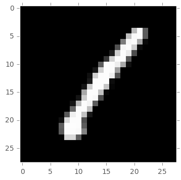
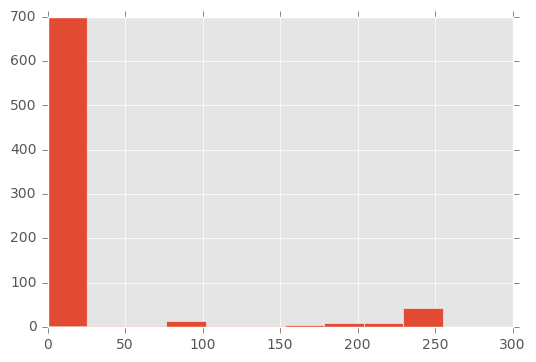
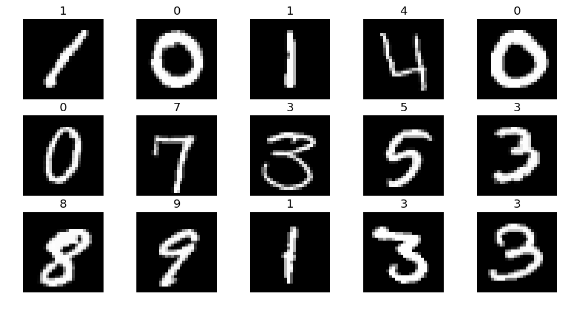
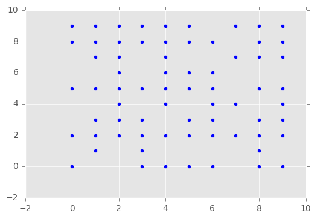
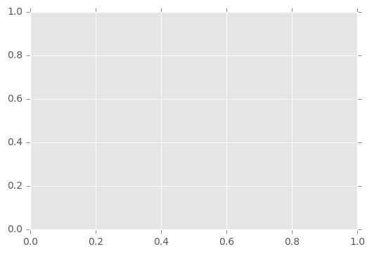

### Import Modules


```python
import pandas as pd
import matplotlib.pyplot as plt, matplotlib.image as mpimg
from sklearn import svm
import numpy as np
%matplotlib inline
```

### Input data location


```python
test_loc = "D:/Kaggle/DigitRecognizer/test.csv"
train_loc = "D:/Kaggle/DigitRecognizer/train.csv"

plt.style.use('ggplot')
```

### Let's read in the data and look at its shape


```python
df = pd.read_csv(train_loc)
print(df.shape)
```

    (42000, 785)
    

Input data is 42,000 data points with 28x28 pixels and a label per record


```python
# Let's only take in the first 5000 images
images = df.iloc[0:5000, 1:]
labels = df.iloc[0:5000, 0]
```


```python
img = images.iloc[0]
img = img.as_matrix()
img = img.reshape((28,28))

plt.imshow(img, cmap = 'gray', interpolation = 'none')
plt.grid('off')
```





### Let's look at a histogram to see what values it can take


```python
plt.hist(images.iloc[0])
```


    (array([ 700.,    2.,    2.,   14.,    2.,    1.,    4.,    8.,    9.,   42.]),
     array([   0. ,   25.5,   51. ,   76.5,  102. ,  127.5,  153. ,  178.5,
             204. ,  229.5,  255. ]),
     <a list of 10 Patch objects>)





Images are not black and white buy grayscale with values ranging from to to 255


### Let's display the first 15 images with their corresponding label


```python
fig, axes = plt.subplots(3,5)
fig.set_size_inches(12,6)

for i in range(axes.size):
    # Prepare images
    img =  images.iloc[i]
    img = img.as_matrix()
    img = img.reshape((28,28))
    
    # Display images
    ax = axes.item(i)
    ax.imshow(img, cmap='gray', interpolation='none')
    ax.set_title(labels.iloc[i])
    ax.grid('off')
    ax.axis('off')
```





```python
clf = svm.SVC()
clf.fit(images, labels)
```


    SVC(C=1.0, cache_size=200, class_weight=None, coef0=0.0,
      decision_function_shape=None, degree=3, gamma='auto', kernel='rbf',
      max_iter=-1, probability=False, random_state=None, shrinking=True,
      tol=0.001, verbose=False)


```python
clf.score(df.iloc[1000:2000, 1:], df.iloc[1000:2000, 0])
```


    0.113


```python

```


```python

```


```python
images[images > dd1] = 1
```


```python
clf2 = svm.SVC()
clf2.fit(images.iloc[0:2500], labels.iloc[0:2500])
```


    SVC(C=1.0, cache_size=200, class_weight=None, coef0=0.0,
      decision_function_shape=None, degree=3, gamma='auto', kernel='rbf',
      max_iter=-1, probability=False, random_state=None, shrinking=True,
      tol=0.001, verbose=False)


```python
score2 = clf2.score(images.iloc[2500:], labels.iloc[2500:])

print('Score:', score2*100, '%')
```

    The score is now  90.4 %
    


```python
pred2 = clf2.predict(images.iloc[2500:])
```

#### Find a way to get a 9x9 grid with predicted/correct


```python
plt.scatter(pred2[:], labels[2500:])
# , labels.iloc[2500:]]
```


    <matplotlib.collections.PathCollection at 0x2135f7dfcc0>





```python
wrongs = np.vstack([pred2[pred2 != labels[2500:]], labels[2500:][pred2 != labels[2500:]]])
```

    C:\Users\Juan\Anaconda3\lib\site-packages\ipykernel\__main__.py:1: FutureWarning: in the future, boolean array-likes will be handled as a boolean array index
      if __name__ == '__main__':
    


    ---------------------------------------------------------------------------

    ValueError                                Traceback (most recent call last)

    <ipython-input-130-ec0bf58b67bb> in <module>()
    ----> 1 wrongs = np.vstack([pred2[pred2 != labels[2500:]], labels[2500:][pred2 != labels[2500:]]])
    

    C:\Users\Juan\Anaconda3\lib\site-packages\numpy\core\shape_base.py in vstack(tup)
        228 
        229     """
    --> 230     return _nx.concatenate([atleast_2d(_m) for _m in tup], 0)
        231 
        232 def hstack(tup):
    

    ValueError: all the input array dimensions except for the concatenation axis must match exactly


```python
wrongs.shape
```


    (2740,)


```python
pred2[0:][pred2 != labels[2500:]].size
```

    C:\Users\Juan\Anaconda3\lib\site-packages\ipykernel\__main__.py:1: FutureWarning: in the future, boolean array-likes will be handled as a boolean array index
      if __name__ == '__main__':
    


    2500


```python
labels[2500:][pred2 != labels[2500:]].size
```


    2260


```python
pred2.size
```


    2500


```python

ax.set_yticklabels?

```


```python
for i in range(9):
    img = images.iloc[i]
    img = img.as_matrix()
    img = img.reshape((28,28))
    
    fig, ax = plt.subplots()
    fig.subplot(3,3, i + 1)

'''
    plt.subplot(3, 3, i +1 )
    plt.imshow(img, cmap = 'gray')
    plt.grid('off')
    plt.xaxis
'''
```


    ---------------------------------------------------------------------------

    AttributeError                            Traceback (most recent call last)

    <ipython-input-190-f6823dea9760> in <module>()
          5 
          6     fig, ax = plt.subplots()
    ----> 7     fig.subplot(3,3, i + 1)
          8 
          9 '''
    

    AttributeError: 'Figure' object has no attribute 'subplot'





```python
img.shape
```


    (784,)


```python
plt.ticks
```


    ---------------------------------------------------------------------------

    AttributeError                            Traceback (most recent call last)

    <ipython-input-176-a64cfe2f3f35> in <module>()
    ----> 1 plt.ticks
    

    AttributeError: module 'matplotlib.pyplot' has no attribute 'ticks'


$$c = \sqrt{a^2 + b^2}
$$


```python
n
```


    array([[0, 1],
           [2, 3]])


```python
n.item(3)
```


    3


```python

```


```python

```
